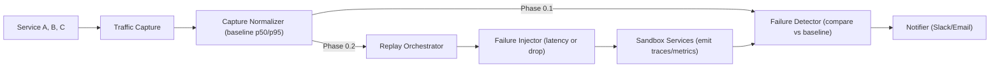

# Adaptive Testing & Debugging Sandbox — MVP Flow Draft

## MVP Scope (aligned with mentor feedback)
We’ll ship this in two thin phases so we can start with **Capture → Detect → Notify**, then add replay/injection:

- **Phase 0.1 (now):** Capture one A→B→C flow, compute baseline metrics, detect anomalies vs. baseline, and notify with a short explanation.
- **Phase 0.2 (next):** Deterministic replay of the same flow and inject exactly one failure (latency OR drop). Keep the same detect/notify path. (AI summaries come later.)

---
## High-Level Flow

**Capture → (optional Replay + Inject) → Detect → Notify**


### One sentence:
We capture real traces, build a replayable bundle with a baseline, and (a) in Phase 0.1 detect regressions from live runs, then (b) in Phase 0.2 deterministically replay with one injected failure and notify when rules trip.

## Core Components (MVP)
### 1) Traffic Capture & Normalizer

Capture API requests between microservices using OpenTelemetry; export spans via OTel Collector (NDJSON).

Normalize into a Capture Bundle (JSON):

requests[] with method, URL, relative timing, and simple dependencies.

baseline with p50/p95 latency and error count from a healthy run.

Example fields:
```json
{
  "meta": {"capture_id":"cap_001","services":["A","B","C"]},
  "baseline": {"p50_ms":120,"p95_ms":220,"errors":0},
  "requests": [
    {"id":"req-1","relative_ms":0,"method":"POST","url":"http://A/checkout"},
    {"id":"req-2","relative_ms":35,"method":"POST","url":"http://B/charge","depends_on":["req-1"]}
  ]
}
```
### 2) Replay Orchestrator (Phase 0.2)

Load the Capture Bundle, set t0, schedule each request at t0 + relative_ms, send via async HTTP client.

Emit fresh traces/metrics to Jaeger/Prometheus.

Produce a Replay Report (JSON) with p50/p95, error rate, and links.

### 3) Failure Injector (Phase 0.2)

Exactly one failure type per run: latency (e.g., +200 ms) or dropped request (p=1.0).

Mechanism: Toxiproxy (preferred) or service middleware.

failure:
  type: latency
  target_service: B
  delay_ms: 200

### 4) Failure Detector (Phase 0.1 & 0.2)

Compare current/replay metrics vs baseline:

Latency regression: (p95_replay - p95_baseline) / p95_baseline >= 0.20

Error regression: error_rate_replay - error_rate_baseline >= 0.02

Identify first failing component (first non-2xx along causal chain).

Output a structured Explanation (JSON + Markdown).

### 5) Notifier

Send Slack (or email) when a rule trips.

Incident: Latency regression on critical path (A→B→C)
- Injected failure (Phase 0.2): +200 ms on Service B
- Baseline vs Current p95: 220 ms → 310 ms (+40.9%)
- First failing component: Service B (req-2, 504)
Links: [Jaeger Trace], [Grafana Chart]

Artifacts & Data Contracts

Replay Report (JSON) — Phase 0.2
```json
{
  "run_id": "run_007",
  "capture_id": "cap_001",
  "latency": {"p50_ms": 140, "p95_ms": 310},
  "errors": 3,
  "ok_ratio": 0.92,
  "evidence": [{"req_id": "req-2", "status": 504, "dur_ms": 420}],
  "links": {"jaeger": "...", "grafana": "..."}
}
```

### Explanation (Markdown)

Incident: Latency regression on critical path (A→B→C)
- Context: replay_id=run_007 (or live check)
- Baseline vs Current p95: 220 ms → 310 ms (+40.9%)
- First failing hop: Service B (req-2, 504 @ 420 ms)
Links: [Jaeger](...), [Grafana](...)

## Tech Stack (MVP)

### Traffic Capture: OpenTelemetry SDKs + OTel Collector (file exporter to NDJSON).

### Replay/Orchestrator: Python (asyncio + httpx). (Phase 0.2)

### Failure Injection: Toxiproxy (latency/drop). (Phase 0.2)

### Observability: Jaeger (traces), Prometheus + Grafana (metrics).

### Notification: Slack webhook (JSON payload) or email.

### Storage: JSON bundles in /captures, reports in /reports.
