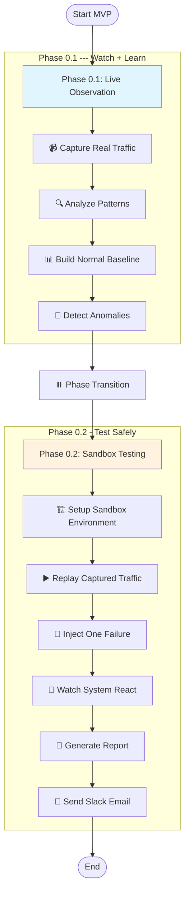
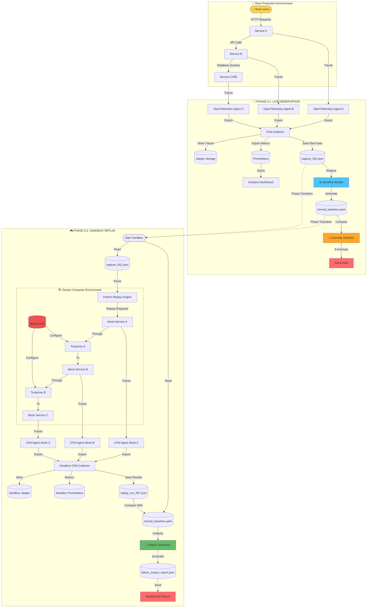
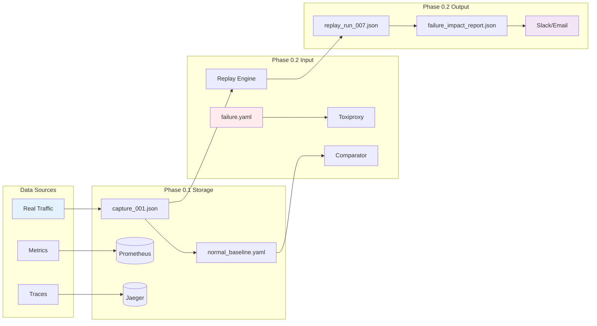
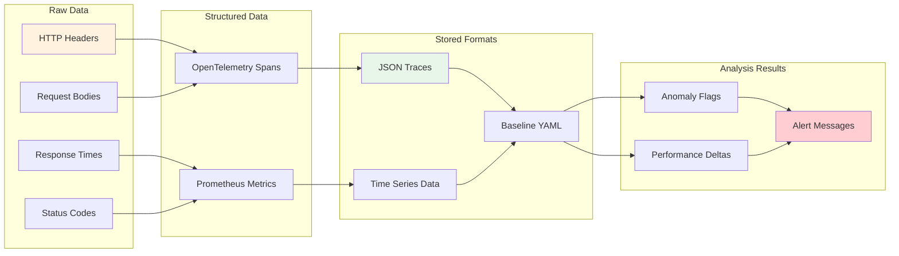

# Adaptive Testing & Debugging Sandbox — MVP Flow Draft

## Executive Summary

This project is like a practice arena for microservices.

**Phase 0.1 (Live Observation)**: We watch how services normally talk to each other and record those interactions.

**Phase 0.2 (Sandbox Replay)**: We replay the same traffic in a safe environment, inject one failure (like delay or dropped request), and see how the system reacts.

👉 These phases don't run at the same time. First we capture and learn (Phase 0.1), then we replay and test (Phase 0.2).

## Analogy for Beginner Developers

Think of it like debugging a multiplayer game:

In **Phase 0.1**, you just watch how players move and interact in real matches. You write down what "normal" looks like (e.g., most players move at speed X).

In **Phase 0.2**, you replay the same match in a training mode, but this time you add an obstacle or slow one player down to see how the whole game reacts.

## High-Level Flow

**Phase 0.1: Capture → Baseline → Detect → Notify → Transition → → → Phase 0.2: Replay → Inject → Detect → Notify**

## Step-by-Step Flow

### Phase 0.1: Live Observation

1. **Capture traffic** — Use OpenTelemetry to record real requests between services.
2. **Build a baseline** — Measure what's "normal" (e.g., Service B usually replies in 200ms with <2% errors).
3. **Detect changes** — If future runs show slower replies or higher error rates, we flag it.
4. **Notify** — Send a Slack/email with a short summary of what changed.

### Phase 0.2: Sandbox Replay

1. **Replay traffic** — Re-run the same captured requests in a safe test environment.
2. **Inject one failure** — Add either artificial delay or drop a request using Toxiproxy.
3. **Observe effects** — Measure how the system reacts under failure.
4. **Notify** — Send another alert/report explaining which service failed first and by how much.

## Tech Stack (MVP)

- **OpenTelemetry + Collector** → the “microphones and video camera” 🎤📹

    - Captures every conversation between services (A → B → C).

    - The Collector exports those traces into a neat JSON/NDJSON file (the “recording”) so we can replay later.

- **Jaeger** → the “video player” 🎬

    - Stores and visualizes those service traces.

    - Lets us rewind and see: “Oh, Service B was 200ms slower here.”

- **Prometheus + Grafana** → the “scoreboard and scoreboard screen” 📊

    - Prometheus = collects metrics (how fast, how many errors).

    - Grafana = dashboard to make those numbers look understandable (charts, alerts).

- **Python (asyncio + httpx)** → the “replay engine” ▶️

    - Reads the captured JSON bundle.

    - Replays requests in the same order/timing as the original run.

    - Easy for us devs to write quickly (asyncio for timing, httpx for HTTP).

- **Toxiproxy** → the “mischief remote control” 💉

    - Lets us break one thing on purpose (add delay, drop a request).

    - Example: “Make Service B 200ms slower this run.”

- **Docker Compose** → the “sandbox builder” 🏗️

    - Spins up local copies of Jaeger, Prometheus, Grafana, Toxiproxy, and our services in one simple config file.

    - Lighter weight than Kubernetes — faster for MVP development.

- **Slack Webhooks** → the “alarm bell” 🚨

    - When anomalies are detected, send a short message straight to Slack:

    - Example: “⚠️ Service B latency +40% (220ms → 310ms).”

- **JSON/YAML files** → the “notebooks and rulebooks” 📒

    - Capture bundles (what we recorded), replay reports, and failure injection configs all live here.

    - Example: capture_001.json, replay_run_007.json, failure.yaml.

    - Makes tests reproducible without needing a database.

## Simple BDD Conditions

### When Things Are Normal:
- **GIVEN** Service A usually responds in 50-100ms
- **WHEN** Service A responds in 75ms
- **THEN** Mark as "✅ Normal"

### When Things Go Wrong:
- **GIVEN** Service B normally handles 100 requests/minute
- **WHEN** Service B suddenly drops to 10 requests/minute
- **THEN** Send alert: "⚠️ Service B is really slow!"

### During Testing:
- **GIVEN** We're in sandbox mode with fake traffic
- **WHEN** We make Database connection 50% slower
- **THEN** Measure if checkout still works or times out

## Simple Testing Rules

- If p95 latency increases by 20%, send alert.
- If error rate increases by >2%, send alert.
- Always flag the first failing service in the chain.

# Data Flow Chart - Adaptive Testing & Debugging Sandbox

## Complete Data Flow Diagram

## Simplified Data Flow - Key Data Points

## Data Transformation Pipeline

## Key Data Files & Formats

| File | Purpose | Format | Example Content |
|------|---------|--------|-----------------|
| `capture_001.json` | Stores captured real traffic | JSON/NDJSON | Request headers, bodies, timings |
| `normal_baseline.yaml` | Defines "normal" behavior | YAML | p50: 50ms, p95: 100ms, error_rate: 0.01 |
| `failure.yaml` | Configures injected failures | YAML | service: B, type: latency, value: 200ms |
| `replay_run_007.json` | Stores sandbox test results | JSON | Actual vs expected metrics |
| `failure_impact_report.json` | Final analysis report | JSON | Which services degraded, by how much |

## Data Flow Summary

1. **Real traffic** flows through production services
2. **OpenTelemetry agents** capture every interaction
3. **Collector** aggregates and exports to multiple destinations
4. **Phase 0.1** builds baseline from captured data
5. **Phase transition** moves captured data to sandbox
6. **Phase 0.2** replays data through Toxiproxy-wrapped services
7. **Comparison engine** detects deviations from baseline
8. **Reports** flow to Slack/Email for human review

*Note: Dotted lines (- - -) represent phase transitions where data moves from observation to testing phase.*
---

## Why It Matters

Instead of waiting for production outages, this sandbox helps us:

- Understand what "normal" looks like in our system.
- Test failures safely before real users are impacted.
- Find weak spots early, saving debugging time and avoiding downtime.
- This is like building a safety net: we first watch the real system, then practice breaking it in a safe copy so we know how to react before real users are impacted.
